```markdown
# System Architecture Document: LoyalNest Shopify App

## 1. Overview
The LoyalNest Shopify app is a loyalty and rewards platform designed to enhance customer retention and repeat purchases for Shopify merchants, competing with Smile.io, Yotpo, and LoyaltyLion. It targets small (100–1,000 customers, AOV $20–$50), medium (1,000–10,000 customers, AOV $50–$200), and Shopify Plus merchants (10,000+ customers, multi-store setups). The system employs a microservices architecture in an Nx monorepo for modularity, scalability, and independent deployments, supporting 5,000+ merchants and 50,000+ customers for Plus, with Black Friday surges (10,000 orders/hour). It leverages NestJS (TypeScript) for APIs, Rust/Wasm for Shopify Functions, Vite + React for the frontend, PostgreSQL with JSONB and range partitioning for data storage, Redis Cluster with Streams for caching, Kafka for event-driven processing, and Loki + Grafana for logging and monitoring, deployed on a VPS with Docker Compose and Nginx. Must Have features for the TVP (7–8 months) include points (purchases, signups, reviews, birthdays), SMS/email referrals, merchant referrals, basic RFM analytics (Recency, Frequency, Monetary), Shopify POS with offline mode, checkout extensions, GDPR/CCPA request form, referral status with progress bar, notification templates with live preview and fallback language, customer import, campaign discounts, rate limit monitoring with alerts, usage thresholds, upgrade nudges, gamified onboarding, and merchant feedback integration. The system ensures GDPR/CCPA compliance, Shopify App Store requirements, multilingual support (English, Spanish, French, Arabic with RTL), and disaster recovery with Backblaze B2.

## 2. System Objectives
- **Scalability**: Support 5,000+ merchants, with Plus merchants handling 50,000+ customers and 10,000 orders/hour during peak events (e.g., Black Friday).
- **Modularity**: Utilize microservices (auth, points, referrals, RFM analytics, event tracking, admin, campaign, gamification) for independent development and deployment, managed via Nx monorepo.
- **Shopify Compliance**: Adhere to Shopify APIs (2025-01), OAuth, webhooks (`orders/create`, GDPR), POS with offline mode, Checkout UI Extensions, Theme App Extensions (Phase 5), and Shopify Flow templates (Phase 5).
- **GDPR/CCPA Compliance**: Encrypt PII (`customers.email`, `rfm_score`) with AES-256 via `pgcrypto`, handle GDPR webhooks (`customers/data_request`, `customers/redact`) with retries, and enforce 90-day retention (`gdpr_requests.retention_expires_at`).
- **Performance**: Achieve API responses <200ms using Redis Cluster caching, PostgreSQL range partitioning, and circuit breakers; coordinate Shopify API rate limits (2 req/s standard, 40 req/s Plus).
- **Developer Efficiency**: Leverage AI tools (GitHub Copilot, Cursor, Grok) for a solo developer, with in-house UI/UX and QA, using Nx monorepo, Docker Compose, and an enhanced `dev.sh` script for mock data, RFM simulation, and audit log replay.
- **Reliability**: Implement disaster recovery with `pg_dump`, Redis snapshotting, and Backblaze B2 backups (90-day retention), plus centralized logging with Loki + Grafana and Chaos Mesh for resilience testing.
- **Merchant Engagement**: Support gamified onboarding, merchant referral program, Slack community (“LoyalNest Collective”), and Typeform feedback integration for adoption.

## 3. System Architecture
The system is built on a microservices architecture, orchestrated with Docker Compose and deployed on a VPS (Ubuntu, Nginx with gRPC proxy). It uses REST APIs for UI-facing endpoints, gRPC for inter-service communication, Kafka for async events, WebSocket for real-time updates, and a combination of PostgreSQL, Redis Cluster, and Loki for data storage, caching, and logging. The frontend is a single-page app using Vite + React, Polaris, Tailwind CSS, and App Bridge, ensuring Shopify compliance and accessibility.

### 3.1 Microservices
The system comprises eight microservices, each built with NestJS (TypeScript) and Rust/Wasm for Shopify Functions, managed in an Nx monorepo:
1. **Auth Service**:
   - **Purpose**: Manages Shopify OAuth, JWT authentication (15-minute expiry, revocation list in Redis), MFA via Auth0, and RBAC (`admin:full`, `admin:analytics`, `admin:support`, `admin:points`).
   - **Endpoints**: `/v1/api/auth/login`, `/v1/api/auth/refresh`, `/v1/api/auth/roles`, `/v1/api/auth/mfa`, `/admin/v1/auth/revoke`.
   - **Tech**: NestJS, `@shopify/shopify-app-express`, Redis Cluster (`jwt:{merchant_id}`, `revoked_jti:{token_id}`), PostgreSQL (`merchants.staff_roles: JSONB`).
   - **Interactions**: Validates tokens for dashboard, widget, and admin module; uses gRPC to fetch roles from Admin Service; supports MFA and emergency revocation for Shopify Plus multi-user access.
2. **Points Service**:
   - **Purpose**: Manages points earning/redemption, Shopify POS with offline mode, checkout extensions, campaign discounts, multi-store point sharing (Phase 5), and real-time streaming.
   - **Endpoints**: `/v1/api/points/earn`, `/v1/api/points/redeem`, `/v1/api/points/adjust`, `/v1/api/rewards`, `/v1/api/points/sync`, `/api/points/stream` (WebSocket).
   - **Tech**: NestJS, Rust/Wasm (Shopify Functions for discounts), PostgreSQL (`points_transactions`, `reward_redemptions`), Redis Cluster (`points:customer:{id}`), `socket.io`/`ws`.
   - **Interactions**: Processes `orders/create` webhooks, syncs POS data via SQLite queue, applies checkout extensions, streams points updates, supports multi-store point sharing, and publishes `points.earned` to Kafka.
3. **Referrals Service**:
   - **Purpose**: Manages SMS/email referrals, merchant referrals, referral status with progress bar, and error handling (timeouts, invalid codes).
   - **Endpoints**: `/v1/api/referrals/create`, `/v1/api/referrals/complete`, `/v1/api/referrals/status`, `/v1/api/referrals/progress`, `/v1/api/referrals/merchant`.
   - **Tech**: NestJS, Klaviyo/Postscript (SMS/email, 5s timeout, 3 retries), Bull queues, PostgreSQL (`referrals`), Redis Streams (`referral:{code}`, `referral:status:{id}`).
   - **Interactions**: Generates referral links (`referral_link_id`, `merchant_referral_id`), sends notifications, tracks conversion (7%+ target), handles errors (`INVALID_REFERRAL_CODE`), and publishes `referral.created` to Kafka.
4. **RFM Analytics Service**:
   - **Purpose**: Provides basic (free plan) and advanced RFM analytics (paid plans, $15–$99/month) with time-weighted recency, lifecycle stages, composite segments (e.g., At-Risk + High Churn), smart nudges, A/B testing, industry benchmarks, and visualizations.
   - **Endpoints**: `/v1/api/rfm/segments`, `/v1/api/rfm/segments/preview`, `/v1/api/rfm/nudges`, `/api/rfm/visualizations`, gRPC (`/analytics.v1/GetSegments`, `/analytics.v1/PreviewRFMSegments`, `/analytics.v1/GetNudges`, `/analytics.v1/GetCompositeSegments`, `/analytics.v1/GetAnalyticsVisualizations`).
   - **Tech**: NestJS, Rust/Wasm (real-time RFM updates), PostgreSQL (`customers.rfm_score: JSONB`, `rfm_segment_counts`, `rfm_segment_deltas`, `rfm_score_history`, `rfm_benchmarks`), Redis Streams (`rfm:customer:{id}`, `rfm:preview:{merchant_id}`, `rfm:composite:{merchant_id}`).
   - **Interactions**: Calculates RFM scores (Recency: ≤7 to >90 days, Frequency: 1 to >10 orders, Monetary: <0.5x to >5x AOV), supports composite segments, refreshes daily (`0 1 * * *`), caches in Redis Streams, and supports visualizations (heatmaps, line charts).
5. **Event Tracking Service**:
   - **Purpose**: Tracks feature usage and events for analytics and merchant engagement.
   - **Endpoints**: `/v1/api/events`.
   - **Tech**: NestJS, PostHog, Kafka.
   - **Interactions**: Captures events (`points_earned`, `referral_clicked`, `rfm_preview_viewed`, `gdpr_request_submitted`, `notification_template_edited`, `campaign_discount_redeemed`, `rate_limit_viewed`, `plan_limit_warning`, `merchant_referral_created`, `rfm_nudge_clicked`, `composite_segment_viewed`, `visualization_viewed`, `setup_progress_viewed`, `badge_awarded`, `leaderboard_viewed`, `flow_template_installed`, `audit_replay_executed`, `merchant_feedback_submitted`) and sends to PostHog via Kafka.
6. **Admin Service**:
   - **Purpose**: Manages merchant accounts, points, referrals, RFM segments, logs, GDPR requests, rate limits, customer imports, notification templates, integration health, onboarding, multi-currency settings, and feedback.
   - **Endpoints**: `/admin/merchants`, `/admin/points/adjust`, `/admin/referrals`, `/admin/rfm-segments`, `/admin/rfm/export`, `/admin/rfm/visualizations`, `/admin/logs`, `/admin/notifications/template`, `/admin/rate-limits`, `/admin/customers/import`, `/admin/queues`, `/v1/api/plan/usage`, `/admin/setup/stream`, `/admin/settings/currency`, `/admin/integrations/square`, `/admin/v1/feedback`, `/admin/v1/metrics`, gRPC (`/admin.v1/UpdateNotificationTemplate`, `/admin.v1/GetRateLimits`, `/admin.v1/ImportCustomers`, `/admin.v1/GetChurnPrediction`, `/admin.v1/StreamSetupProgress`, `/admin.v1/UpdateCurrencySettings`, `/admin.v1/ConfigureSquareIntegration`).
   - **Tech**: NestJS, PostgreSQL (`gdpr_requests`, `email_templates: JSONB`, `audit_logs`, `integrations`, `setup_tasks`, `merchant_settings`), Redis Streams (logs, rate limits, `setup_tasks:{merchant_id}`), Kafka (async imports), Bull queues (imports, exports), `socket.io`/`ws`, Nginx (IP allowlisting, HMAC).
   - **Interactions**: Handles GDPR webhooks with retries, RBAC with IP allowlisting, rate limit alerts (Slack/email via AWS SNS), async CSV imports with GDPR-compliant encryption, real-time log/streaming, predictive analytics, onboarding progress, multi-currency settings, Square integration, and Typeform feedback.
7. **Campaign Service**:
   - **Purpose**: Manages Shopify Discounts API campaigns and VIP multipliers.
   - **Endpoints**: `/api/campaigns`, `/api/campaigns/{id}`, gRPC (`/campaign.v1/CreateCampaign`, `/campaign.v1/GetCampaign`).
   - **Tech**: NestJS, Rust/Wasm (Shopify Functions), PostgreSQL (`campaigns: JSONB`), Redis Cluster (`campaign:{campaign_id}`).
   - **Interactions**: Creates/applies campaign discounts, integrates with RFM composite segments, and publishes `campaign_created`, `campaign_viewed` to Kafka.
8. **Gamification Service**:
   - **Purpose**: Manages badge awards and leaderboards for customer engagement.
   - **Endpoints**: `/api/gamification/badges`, `/api/gamification/leaderboard`, gRPC (`/gamification.v1/AwardBadge`, `/gamification.v1/GetLeaderboard`).
   - **Tech**: NestJS, PostgreSQL (`customer_badges`, `leaderboard_rankings`), Redis Cluster (`badge:{customer_id}:{badge_id}`, `leaderboard:{merchant_id}:{page}`).
   - **Interactions**: Awards badges, ranks customers, caches data in Redis, and publishes `badge_awarded`, `leaderboard_viewed` to Kafka.

### 3.2 Frontend
- **Merchant Dashboard** (`WelcomePage.tsx`, `SettingsPage.tsx`, `RFMWizardPage.tsx`, `BonusCampaignsPage.tsx`):
  - Built with Vite + React, Polaris, Tailwind CSS, App Bridge, `i18next` (English, Spanish, French, Arabic with RTL, `fallback_language: en`).
  - Features: Points configuration, referral setup, RFM analytics with wizard, Chart.js visualizations (RFM segments, heatmaps, line charts, rate limits, merchant timelines, SLOs), checkout extension customization, notification templates with live preview, rate limit monitoring, usage thresholds (progress bar), upgrade nudges, gamified onboarding, campaign management, Typeform feedback integration.
- **Customer Widget** (`Widget.tsx`, `ReferralProgress.tsx`):
  - Embeddable React component for points balance, redemption, SMS/email referral popup, GDPR request form, referral status with progress bar, RFM smart nudges, badges, and leaderboards.
  - Supports Theme App Extensions (Phase 5) and multilingual support.
- **Admin Module** (`AdminPage.tsx`, `QueuesPage.tsx`, `RateLimitsPage.tsx`):
  - Manages merchants, RFM segments, logs (WebSocket streaming), rate limits (Chart.js), multi-user roles (RBAC with IP allowlisting), customer imports, notification templates, integration health (Shopify, Klaviyo, Postscript, Square), onboarding progress (WebSocket), multi-currency settings, campaign management, SLO dashboard, and feedback.
- **Accessibility/Performance**: Lighthouse CI (90+ scores for ARIA, keyboard nav, LCP, FID, CLS), multilingual support with `i18next`, RTL for Arabic.

### 3.3 Data Storage
- **PostgreSQL**:
  - Schema: `loyalnest_full_schema.sql`.
  - Tables: `customers` (email, merchant_id, rfm_score: JSONB), `points_transactions`, `referrals` (referral_link_id, merchant_referral_id), `reward_redemptions` (campaign_id), `vip_tiers`, `program_settings` (rfm_thresholds: JSONB), `email_templates` (body: JSONB, `fallback_language`), `gdpr_requests` (retention_expires_at), `rfm_segment_counts`, `rfm_segment_deltas`, `rfm_score_history`, `rfm_benchmarks`, `audit_logs`, `integrations`, `setup_tasks`, `merchant_settings` (currencies: JSONB), `customer_badges`, `leaderboard_rankings`, `merchant_feedback`.
  - Indexes: `customers(email, merchant_id, rfm_score)`, `points_transactions(customer_id)`, `referrals(merchant_id, referral_link_id)`, `reward_redemptions(campaign_id)`, `gdpr_requests(retention_expires_at)`, `rfm_score_history(customer_id)`, `audit_logs(merchant_id)`, `setup_tasks(merchant_id)`, `tsvector` for search (`merchants.name`, `customers.email`).
  - Partitioning: Range partitioning on `created_at` for `points_transactions`, `referrals`, `reward_redemptions`, `rfm_segment_counts`, `audit_logs`.
  - Encryption: PII (`customers.email`, `rfm_score`) with AES-256 via `pgcrypto`, quarterly key rotation via AWS KMS.
  - Refresh: Incremental refresh for `rfm_segment_counts` via `rfm_segment_deltas` (daily, `0 1 * * *`).
- **Redis Cluster**:
  - Caches: Points balances (`points:customer:{id}`), referral codes (`referral:{code}`), webhook idempotency keys, rate limits (`shopify_api_rate_limit:{merchant_id}`), notification templates, usage thresholds, RFM previews (`rfm:preview:{merchant_id}`), composite segments (`rfm:composite:{merchant_id}`), badges (`badge:{customer_id}:{badge_id}`), leaderboards (`leaderboard:{merchant_id}:{page}`), setup tasks (`setup_tasks:{merchant_id}`), SLO metrics (`admin:slo:{merchant_id}`), IP whitelists (`admin:ip_whitelist:{merchant_id}`).
  - Streams: Real-time logs (`logs:{merchant_id}`), queue monitoring (`queues:{merchant_id}`), RFM caching (`rfm:customer:{id}`).
  - Dead-letter queue for GDPR webhook retries (3 retries).
- **Backblaze B2**:
  - Stores daily backups (`pg_dump`, Redis snapshots) with 90-day retention.

### 3.4 Event Processing
- **Kafka**:
  - Handles async events: `points.earned`, `referral.created`, `merchant.referral.created`, `customer.imported`, `campaign_discount_redeemed`, `rfm_nudge_clicked`, `composite_segment_viewed`, `visualization_viewed`, `setup_progress_viewed`, `badge_awarded`, `leaderboard_viewed`, `flow_template_installed`, `audit_replay_executed`, `merchant_feedback_submitted`.
  - Ensures decoupling and reliable delivery with retries.
- **PostHog**:
  - Tracks feature usage: `points_earned`, `referral_clicked`, `rfm_preview_viewed`, `gdpr_request_submitted`, `notification_template_edited`, `campaign_rfm_conversion`, `rate_limit_viewed`, `plan_limit_warning`, `merchant_referral_created`, `rfm_nudge_clicked`, `composite_segment_viewed`, `visualization_viewed`, `setup_progress_viewed`, `badge_awarded`, `leaderboard_viewed`, `flow_template_installed`, `audit_replay_executed`, `merchant_feedback_submitted`.

### 3.5 Integrations
- **Shopify**:
  - APIs: Orders, customers, discounts (2025-01), Flow templates (6–10, e.g., “RFM At-Risk → Email Nudge”).
  - Webhooks: `orders/create` (batched), GDPR (`customers/data_request`, `customers/redact`, 3 retries).
  - POS: Offline mode with SQLite queue, sync via `/v1/api/points/sync`.
  - Checkout: Checkout UI Extensions for points redemption and RFM nudges.
  - Theme App Extensions: Widget deployment (Phase 5).
  - Shopify Flow: Prebuilt templates with public GitHub repo and install nudges.
- **Klaviyo/Postscript**: SMS/email referrals, notification templates (with `fallback_language`), A/B testing for RFM nudges, timeout handling (5s retry).
- **Yotpo/Judge.me**: Points for reviews.
- **Klaviyo/Mailchimp**: Automated loyalty email flows with RFM segmentation.
- **Square**: POS integration with health checks (`/admin/integrations/square`).

### 3.6 Deployment
- **VPS**: Ubuntu with Docker Compose, Nginx (reverse proxy, gRPC proxy, frontend assets, IP allowlisting, HMAC signatures), and circuit breakers (`nestjs-circuit-breaker`).
- **CI/CD**: GitHub Actions with change detection, Jest/Cypress/k6 tests, Lighthouse CI, OWASP ZAP, Chaos Mesh (nightly resilience tests), daily backups, and Slack alerts for pipeline failures.
- **Local Development**: `dev.sh` script starts Docker containers, seeds mock data (Faker), simulates RFM scores, supports merchant referral program, gamified onboarding, and audit log replay (`replay-audit.ts`).
- **Disaster Recovery**: `pg_dump`, Redis snapshotting, Backblaze B2 backups with 90-day retention.
- **Feature Flags**: `feature-flags.json` for gradual admin feature rollouts (e.g., undo bulk updates), canary routing via Nginx.

### 3.7 Monitoring and Logging
- **Loki + Grafana**:
  - Centralized logging with structured tags (`shop_domain`, `merchant_id`, `service_name`, `trace_id`, `span_id`).
  - Monitors API latency (<200ms), database performance, rate limits (alerts at 80% via Slack/email), integration health, circuit breaker states, and SLOs (e.g., `/v1/api/points/redeem` success rate, queue latency).
- **PostHog**: Tracks feature adoption (80%+ RFM wizard completion, 7%+ SMS referral conversion), merchant engagement, and campaign performance (15%+ discount redemption for Plus).
- **Queue Monitoring**: Bull queue metrics visualized in `QueuesPage.tsx` with Chart.js.
- **SLO Dashboard**: `/admin/v1/metrics` endpoint with Chart.js visualizations for SLOs (e.g., 99% API success rate, <2s queue latency).

### 4. Data Flow
1. **Merchant Authentication**:
   - Merchant logs in via Shopify OAuth (`/v1/api/auth/login`) with MFA via Auth0.
   - Auth Service issues JWT (15 minutes), cached in Redis, supports revocation (`/admin/v1/auth/revoke`).
2. **Points and Rewards**:
   - `orders/create` webhook triggers Points Service to calculate points (1 point/$).
   - Shopify Functions (Rust) apply campaign discounts based on RFM conditions.
   - Checkout UI Extensions display/redeem points, streamed via `/api/points/stream`.
   - Multi-store point sharing syncs via `/v1/api/points/sync`.
   - Events (`points.earned`, `campaign_discount_redeemed`) sent to Kafka/PostHog.
3. **Referrals**:
   - Referrals Service generates referral links, sends notifications via Klaviyo/Postscript (5s timeout, 3 retries).
   - Referral status cached in Redis Streams, displayed via `ReferralProgress.tsx`.
   - Events (`referral.created`, `referral_clicked`, `merchant_referral_created`) sent to Kafka/PostHog.
4. **RFM Analytics**:
   - RFM Analytics Service calculates scores (`customers.rfm_score: JSONB`) with composite segments (e.g., At-Risk + High Churn).
   - `rfm_segment_counts` refreshed daily via `rfm_segment_deltas`.
   - Segments and visualizations (heatmaps, line charts) cached in Redis Streams, previewed via `/v1/api/rfm/segments/preview`, `/api/rfm/visualizations`.
5. **GDPR Compliance**:
   - Admin Service handles GDPR webhooks (`customers/data_request`, `customers/redact`, 3 retries), stores in `gdpr_requests`.
   - PII encrypted with AES-256 via `pgcrypto`, retries via Redis dead-letter queue.
6. **Admin Operations**:
   - Admin Service manages merchants, RFM segments, logs, rate limits, imports, notification templates, onboarding (`/admin/setup/stream`), multi-currency settings, Square integration, SLO dashboard, and Typeform feedback (`/admin/v1/feedback`).
   - Rate limits coordinated via Redis Streams, alerts via Slack/email.
7. **Notifications**:
   - Notification templates (`email_templates.body: JSONB`, `fallback_language: en`) configured via `/admin/notifications/template`, sent via Klaviyo/Postscript.

### 5. Scalability and Performance
- **Horizontal Scaling**: Microservices deployed independently via Docker Compose, with Redis Cluster and PostgreSQL replication.
- **Database Optimization**: Range partitioning, `tsvector` indexes for search, materialized views for RFM analytics.
- **Caching**: Redis Streams for points, referrals, rate limits, RFM previews, badges, leaderboards, setup tasks, SLO metrics (<50ms latency).
- **Rate Limiting**: Centralized tracking in Redis, middleware, and circuit breakers.
- **Load Testing**: k6 tests for 5,000 merchants (50,000 customers, 10,000 orders/hour, 100 WebSocket connections).
- **Chaos Testing**: Nightly Chaos Mesh experiments in GitHub Actions.
- **Future Scaling (Phase 6)**: Migrate to Kubernetes with Envoy sidecars, managed DB/Redis, ElasticSearch for search/logs.

### 6. Security
- **Authentication**: Short-lived JWTs (15 minutes) with refresh tokens, MFA via Auth0, RBAC, Redis revocation list (`revoked_jti:{token_id}`), IP allowlisting, HMAC signatures for `/admin/*`.
- **Encryption**: PII encrypted with AES-256 via `pgcrypto`, quarterly key rotation via AWS KMS.
- **GDPR/CCPA**: Webhook handlers with 3 retries, 90-day data retention, Backblaze B2 backups.
- **Webhook Idempotency**: Redis-based keys for `orders/create` and GDPR webhooks.
- **Penetration Testing**: OWASP ZAP for XSS, SQL injection, and API vulnerabilities.

### 7. Development Tools
- **Nx Monorepo**: Manages microservices, frontend, and shared libraries with change detection.
- **AI Tools**: GitHub Copilot, Cursor, Grok for code, tests, schemas, RFM simulation, and audit replay (`replay-audit.ts`).
- **Testing**: Jest (unit, integration), Cypress (E2E), k6 (load testing), Lighthouse CI (accessibility, performance), OWASP ZAP (security), Chaos Mesh (resilience).
- **Local Setup**: `dev.sh` script for Docker containers, mock data (Faker), RFM simulation, audit replay, and merchant referral testing.
- **CI/CD**: GitHub Actions with change detection, nightly Chaos Mesh tests, daily backups, Shopify API changelog monitoring, and Slack alerts.

### 8. Architecture Diagram

```mermaid
graph TD
    A[Merchant Dashboard<br>Vite + React, Polaris, Tailwind, App Bridge] -->|REST, WebSocket| B[Auth Service<br>NestJS, Shopify OAuth, Auth0 MFA]
    A -->|REST, WebSocket| C[Points Service<br>NestJS, Rust/Wasm]
    A -->|REST| D[Referrals Service<br>NestJS, Klaviyo/Postscript]
    A -->|REST| E[RFM Analytics Service<br>NestJS, Rust/Wasm]
    A -->|REST| F[Event Tracking Service<br>NestJS, PostHog]
    A -->|REST, WebSocket| G[Admin Service<br>NestJS, RBAC]
    A -->|REST| H[Campaign Service<br>NestJS, Rust/Wasm]
    A -->|REST| I[Gamification Service<br>NestJS]
    J[Customer Widget<br>Vite + React, Theme App Extensions] -->|REST, WebSocket| C
    J -->|REST| D
    J -->|REST| E
    J -->|REST| I
    B -->|gRPC| G
    C -->|gRPC| E
    C -->|Kafka| F
    D -->|Kafka| F
    E -->|Kafka| F
    G -->|Kafka| F
    H -->|Kafka| F
    I -->|Kafka| F
    K[Shopify APIs<br>Orders, Customers, Discounts, Flow] -->|Webhooks| C
    K -->|Webhooks| G
    L[Klaviyo/Postscript<br>SMS/Email, A/B Testing] -->|API| D
    M[Yotpo/Judge.me<br>Reviews] -->|API| C
    N[Klaviyo/Mailchimp<br>Email Flows] -->|API| C
    O[Square<br>POS, Payments] -->|API| G
    P[PostgreSQL<br>JSONB, Partitioning, pgcrypto] --> B
    P --> C
    P --> D
    P --> E
    P --> G
    P --> H
    P --> I
    Q[Redis Cluster<br>Caching, Streams, Rate Limits] --> B
    Q --> C
    Q --> D
    Q --> E
    Q --> G
    Q --> H
    Q --> I
    R[Kafka<br>Events] --> F
    S[Loki + Grafana<br>Logging, Monitoring] --> B
    S --> C
    S --> D
    S --> E
    S --> F
    S --> G
    S --> H
    S --> I
    T[Backblaze B2<br>Backups, 90-day Retention] --> P
    T --> Q
    U[VPS<br>Ubuntu, Docker, Nginx] --> A
    U --> B
    U --> C
    U --> D
    U --> E
    U --> F
    U --> G
    U --> H
    U --> I
    U --> P
    U --> Q
    U --> R
    U --> S
```


### 9. Assumptions and Constraints
- **Assumptions**:
  - Shopify API stability (2025-01) during 39.5-week development.
  - AI tools reduce coding effort by 30–40%.
  - VPS with Docker Compose supports 5,000 merchants; Kubernetes with Envoy in Phase 6.
  - Feedback from 5–10 Shopify Partners via Typeform validates TVP.
  - Slack community drives 100+ merchants post-launch.
- **Constraints**:
  - Solo developer with in-house UI/UX and QA.
  - Budget: $91,912.50 ($74,750 development, $3,000 marketing, $4,000 support infrastructure, $11,362.50 contingency).
  - Timeline: 39.5 weeks for TVP.

### 10. Future Considerations (Phase 6)
- **Should Have Features (Phase 4–5)**: VIP tiers, advanced RFM (multi-segment, real-time updates), exit-intent popups, behavioral segmentation, multi-store point sharing, Shopify Flow templates, Theme App Extensions.
- **Could Have Features (Phase 6)**: Gamification (badges, leaderboards), multilingual widget, multi-currency discounts, non-Shopify POS, advanced analytics, AI reward suggestions (xAI API, https://x.ai/api), custom webhooks, product-level RFM, AI-powered churn prediction.
- **Scaling**: Migrate to Kubernetes with Envoy sidecars, managed DB/Redis, ElasticSearch for search/logs.
- **Certification**: Apply for Built for Shopify certification (4.5+ star rating, 90%+ merchant satisfaction).
```