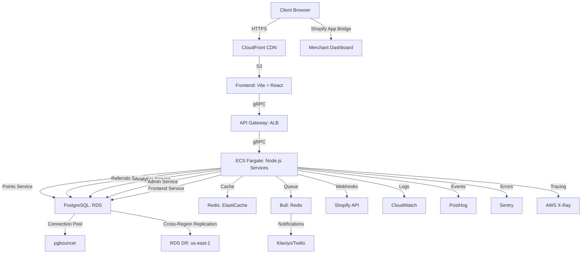

```markdown
# LoyalNest Deployment and Infrastructure Guide

## 1. Overview
This guide outlines the deployment process and infrastructure setup for the LoyalNest Shopify app, supporting the Merchant Dashboard, Customer Widget, Admin Module, and backend integrations. The app is built with Vite + React, Shopify Polaris, Tailwind CSS, App Bridge, Node.js, gRPC, PostgreSQL, Redis, and Docker, targeting 5,000+ merchants and 50,000+ customers (Shopify Plus). It ensures GDPR/CCPA compliance, multilingual support (`en`, `es`, `fr` via i18next), and high availability (99.9% uptime).

## 2. Infrastructure Architecture
### 2.1 Components
- **Frontend**: Vite + React, hosted on AWS S3 with CloudFront CDN.
  - Minified assets (<50KB Widget, <200KB Dashboard), WebP images, lazy-loaded Chart.js.
  - Shopify App Bridge for embedded dashboard, Polaris for UI, Tailwind for responsive layouts (`sm: 320px, md: 768px`).
- **Backend**: Node.js with gRPC services (`/points.v1/*`, `/referrals.v1/*`, `/admin.v1/*`, `/analytics.v1/*`, `/frontend.v1/*`).
  - Dockerized, orchestrated via AWS ECS (Fargate).
- **Database**: PostgreSQL 15 (AWS RDS, read replicas for Plus-scale).
  - Partitioned tables (`points_transactions`, `referrals`, `reward_redemptions`, `customer_segments`, `email_events`, `nudge_events`, `bonus_campaigns`, `gamification_achievements`, `leaderboards`, `team_leaderboards`, `data_imports`, `data_export_requests`, `merchant_referrals`, `slack_community`, `onboarding_tasks`, `rfm_score_history`, `analytics_reports`, `analytics_report_schedules`) by `merchant_id`.
  - Materialized view (`rfm_segment_counts`) for RFM analytics.
  - Indexes: `idx_customers_rfm_score_at_risk`, `idx_points_transactions_order_id`, `idx_rfm_score_history_merchant_id_customer_id`.
  - AES-256 encryption for `customers.email`, `customers.first_name`, `customers.last_name`, `customers.churn_score`, `reward_redemptions.discount_code`, `email_events.recipient_email`.
- **Cache**: Redis (AWS ElastiCache) for `points:{customer_id}`, `rfm:preview:{merchant_id}`, `leaderboard:{merchant_id}`.
- **Queue**: Bull (Redis-backed) for notifications (Klaviyo/Twilio), campaign scheduling, and `rfm_segment_counts` refresh.
- **Integrations**: Shopify (OAuth, webhooks, GraphQL Admin API), Klaviyo, Twilio, Postscript, Square (Phase 3).
- **Monitoring**: PostHog for UI events (e.g., `points_earned`, `sticky_bar_clicked`, `rfm_segment_deltas_updated`), Sentry for errors, AWS CloudWatch for metrics, AWS X-Ray for gRPC tracing.

### 2.2 Architecture Diagram


## 3. Deployment Process
### 3.1 Prerequisites
- **AWS Account**: Configured with IAM roles for ECS, RDS, ElastiCache, S3, CloudFront, X-Ray.
- **Shopify Partner Account**: App registered, OAuth keys generated, webhook subscriptions (`orders/create`, `customers/redact`).
- **GitHub Repository**: Nx monorepo with `/apps/frontend`, `/apps/backend`, `/tests`, `/docs`.
- **Tools**: Docker, AWS CLI, Terraform, GitHub Actions.

### 3.2 Deployment Steps
1. **Code Preparation**:
   - Commit to `/main` branch in Nx monorepo.
   - Run `nx build frontend` (Vite, minifies to <50KB for Widget, <200KB for Dashboard).
   - Run `nx build backend` (TypeScript to Node.js, Dockerized gRPC services).

2. **Docker Image Build**:
   - Build images: `docker build -t loyalnest-frontend:latest .` (frontend), `docker build -t loyalnest-backend:latest .` (backend).
   - Push to AWS ECR: `aws ecr get-login-password | docker login --username AWS --password-stdin <account>.dkr.ecr.<region>.amazonaws.com`.

3. **Infrastructure Provisioning**:
   - Use Terraform (`/infra/main.tf`) to provision:
     - S3 bucket for frontend assets.
     - CloudFront CDN with HTTPS, WAF for XSS/CSRF protection.
     - ECS Fargate cluster (2 tasks per service, auto-scaling to 10 tasks at 80% CPU).
     - RDS PostgreSQL (t3.medium, 2 read replicas, automated backups with 90-day retention for GDPR).
     - ElastiCache Redis (cache.t3.micro, 2 nodes).
     - ALB for gRPC routing (port 443, gRPC health checks).
     - pgbouncer on ECS for PostgreSQL connection pooling (pool_mode=transaction, max_client_conn=1000).
     - RDS cross-region replication to us-east-1 for DR.
     - X-Ray for gRPC tracing.
   - Apply: `terraform apply -var-file=prod.tfvars`.

4. **Deployment**:
   - Deploy frontend to S3: `aws s3 sync dist/ s3://loyalnest-frontend --delete`.
   - Invalidate CloudFront: `aws cloudfront create-invalidation --distribution-id <id> --paths "/*"`.
   - Deploy backend to ECS: `aws ecs update-service --cluster loyalnest --service backend --force-new-deployment`.
   - Run DB migrations: `nx run backend:migrate` (TypeORM, adds `merchant_id` partitions).

5. **Post-Deployment**:
   - Verify services: `curl https://api.loyalnest.com/health` (ALB endpoint).
   - Check CloudWatch logs for errors (`/aws/ecs/loyalnest`).
   - Validate PostHog events (e.g., `points_balance_viewed`, `rfm_updated`, `rfm_segment_deltas_updated`).
   - Monitor Sentry for runtime errors and X-Ray for gRPC traces.

### 3.3 Rollback Plan
- **Frontend**: Revert to previous S3 version (`aws s3 cp s3://loyalnest-frontend/previous dist/`).
- **Backend**: Roll back ECS task definition to previous revision (`aws ecs update-service --task-definition <previous>`).
- **Database**: Restore RDS snapshot (90-day retention), revert migrations (`nx run backend:migrate:down`). For `rfm_segment_counts`, run `REFRESH MATERIALIZED VIEW CONCURRENTLY rfm_segment_counts` post-restore.

### 3.4 Database Migration for Partitioned Tables
- **Partitioned Tables**: `customer_segments`, `points_transactions`, `referrals`, `reward_redemptions`, `email_events`, `nudge_events`, `bonus_campaigns`, `gamification_achievements`, `leaderboards`, `team_leaderboards`, `data_imports`, `data_export_requests`, `merchant_referrals`, `slack_community`, `onboarding_tasks`, `rfm_score_history`, `analytics_reports`, `analytics_report_schedules` use HASH partitioning on `merchant_id` (8 partitions). TypeORM migrations create parent tables and attach partitions dynamically (e.g., `points_transactions_p0` to `p7`).
- **Materialized View**: `rfm_segment_counts` refreshed via `REFRESH MATERIALIZED VIEW CONCURRENTLY rfm_segment_counts` in a scheduled job (e.g., daily via Bull queue).
- **Migration Command**: `nx run backend:migrate --partition=create` to initialize partitions, `nx run backend:migrate:refresh-rfm` for materialized view updates.
- **Zero-Downtime**: Use `CREATE TABLE IF NOT EXISTS` and `ALTER TABLE ... ATTACH PARTITION` to avoid locking during migrations.

## 4. Infrastructure Configuration
### 4.1 AWS ECS (Fargate)
- **Services**: `points`, `referrals`, `analytics`, `admin`, `frontend` (gRPC, port 50051).
- **Scaling**: Auto-scale at 80% CPU/memory, min 2 tasks, max 10 per service.
- **Networking**: VPC with private subnets, NAT Gateway, ALB for gRPC routing.

### 4.2 PostgreSQL (RDS)
- **Instance**: t3.medium, 100GB storage, 2 read replicas for Plus-scale.
- **Schema**: Partitioned tables by `merchant_id`, materialized view `rfm_segment_counts` for RFM analytics.
- **Backup**: Daily snapshots, 90-day retention for GDPR, cross-region replication to us-east-1.
- **Security**: AES-256 encryption, IAM DB authentication, `pgcrypto` for sensitive fields, row-level security (RLS) for tenant isolation.

### 4.3 Redis (ElastiCache)
- **Instance**: cache.t3.micro, 2 nodes, in-memory caching.
- **Keys**: `points:{customer_id}`, `rfm:preview:{merchant_id}`, `leaderboard:{merchant_id}`.
- **TTL**: 24h for points, 1h for previews, 7d for leaderboards.

### 4.4 CloudFront and S3
- **S3**: Stores minified frontend assets (<50KB Widget, <200KB Dashboard), versioning enabled.
- **CloudFront**: HTTPS, global edge locations, WAF for XSS/CSRF, cache TTL 24h.
- **Compression**: Gzip, WebP images for <2.5s LCP.

### 4.5 Monitoring and Logging
- **CloudWatch**: Metrics (CPU, memory, API latency), logs (`/aws/ecs/loyalnest`).
- **PostHog**: UI events (e.g., `sticky_bar_clicked: 10%+ CTR`, `rfm_exported: 80%+ usage`, `rfm_segment_deltas_updated`).
- **Sentry**: Runtime errors, tagged by `merchant_id`, `customer_id`.
- **X-Ray**: Distributed tracing for gRPC services, e.g., `calculate_rfm_score` calls affecting `rfm_segment_deltas`.
- **Alerts**: CloudWatch alarms for >80% CPU, >0.1% error rate, `rfm_segment_counts` refresh failures, `gdpr_requests` with `retention_expires_at < NOW()`, notified via SNS.

### 4.6 Multi-Tenant Isolation
- **Schema Isolation**: Each `merchant_id` is isolated via HASH partitioning on tables like `points_transactions`, `customer_segments`, etc., ensuring data separation.
- **Connection Pooling**: Use `pgbouncer` (deployed on ECS) for PostgreSQL connection pooling, configured with `pool_mode=transaction` and `max_client_conn=1000` to handle 5,000+ merchants.
- **Query Scoping**: Backend services enforce `merchant_id` filters in all queries (e.g., `SELECT * FROM customers WHERE merchant_id = :merchantId`) to prevent cross-tenant data access.
- **Security**: IAM roles restrict RDS access to specific `merchant_id` partitions via row-level security (RLS) policies, e.g., `ALTER TABLE customers ENABLE ROW LEVEL SECURITY; CREATE POLICY merchant_isolation ON customers USING (merchant_id = current_setting('app.merchant_id')::UUID)`.
- **Monitoring**: Track per-tenant query performance via CloudWatch (e.g., `SELECT merchant_id, AVG(query_duration_ms) FROM audit_logs GROUP BY merchant_id`).

## 5. Security and Compliance
- **Authentication**: Shopify OAuth for merchants, RBAC for admin (`merchants.staff_roles`, `admin_users.metadata`).
- **Encryption**: AES-256 for sensitive fields (`customers.email`, `customers.first_name`, `customers.last_name`, `customers.churn_score`, `reward_redemptions.discount_code`, `email_events.recipient_email`).
- **GDPR/CCPA**: 90-day data retention (`gdpr_requests`), webhooks (`customers/redact`), encrypted backups.
- **Rate Limits**: Shopify API (50 points/s, 100 points/s Plus), exponential backoff (3 retries, 500ms base delay).
- **WAF**: AWS WAF for XSS, CSRF, SQL injection protection on CloudFront.

### 5.1 Integration Error Handling
- **Shopify Webhooks**:
  - **Retry Logic**: Use Bull queue with 3 retries (500ms, 1s, 2s delays) for `orders/create`, `customers/redact` failures.
  - **Dead Letter Queue**: Failed webhooks after retries move to a DLQ (`bull:webhook:failed`), logged to CloudWatch and alerted via SNS.
  - **Rate Limits**: Monitor Shopify API usage (50 points/s, 100 points/s for Plus) via Redis (`shopify:rate_limit:{merchant_id}`), pausing requests at 80% quota.
- **Klaviyo/Twilio**:
  - **Error Handling**: Catch API errors (e.g., 429 Too Many Requests) and retry with exponential backoff (500ms base, 3 retries).
  - **Fallback**: For `email_events` failures (e.g., Klaviyo outage), queue events in Redis (`bull:notifications:failed`) and attempt resend after 1h.
- **Validation**: Use `webhook_idempotency_keys` table to prevent duplicate webhook processing, expiring keys after 24h.

## 6. Scalability and Performance
- **Horizontal Scaling**: ECS auto-scaling (2–10 tasks), RDS read replicas.
- **Caching**: Redis for hot data (e.g., `points:{customer_id}`), CloudFront for static assets.
- **Database**: Partitioning by `merchant_id`, indexes for RFM (`idx_customers_rfm_score_at_risk`, `idx_rfm_score_history_merchant_id_customer_id`).
- **Performance Goals**: <1s API response, <2.5s LCP, <100ms FID, <0.1 CLS.
- **Load Handling**: 1,000 orders/hour (US-BI1), 50,000+ customers (US-MD4), tested with k6.

## 7. Backup and Recovery
- **Database**: RDS daily snapshots, 90-day retention, point-in-time recovery, cross-region replication to us-east-1.
- **Cache**: Redis AOF persistence, daily backups to S3.
- **Frontend**: S3 versioning for asset rollback.
- **Recovery Time**: <1h for DB restore, <10m for ECS redeployment.

### 7.2 Disaster Recovery
- **Cross-Region Failover**: Deploy RDS in a secondary region (e.g., us-west-2 as primary, us-east-1 as DR) with cross-region replication enabled. Configure ECS services to failover to the DR region using Route 53 health checks.
- **Failover Process**:
  1. Promote RDS read replica in DR region to primary (`aws rds promote-read-replica`).
  2. Update ECS services to point to DR RDS endpoint (`aws ecs update-service --cluster loyalnest --service backend --task-definition <new-dr>`).
  3. Redirect CloudFront to DR ALB via Route 53 failover policy.
- **RTO/RPO**: Recovery Time Objective (RTO) <2h, Recovery Point Objective (RPO) <15m, achieved via RDS continuous backups and Redis AOF persistence.
- **Testing**: Conduct quarterly DR drills using Chaos Monkey to simulate region failures, validating failover and data integrity.
- **Backup Validation**: Automate snapshot integrity checks (e.g., `pg_restore --schema-only` on S3 backups) via Lambda.
- **Schema-Specific Recovery**: Post-restore, run `REFRESH MATERIALIZED VIEW CONCURRENTLY rfm_segment_counts` and re-attach partitions for tables like `points_transactions`.

## 8. CI/CD Pipeline
- **GitHub Actions**:
  - **Build**: `nx build`, `docker build` on PRs.
  - **Test**: Jest (`jest --coverage`, 90%+ coverage), Cypress (`cypress run`, 100% critical path), k6, Lighthouse CI, OWASP ZAP.
  - **Deploy**: `aws s3 sync`, `aws ecs update-service`, `terraform apply` on `/main` merge.
  - **Secrets**: AWS Secrets Manager for Shopify OAuth, Klaviyo/Twilio keys.
- **Environments**: Staging (`staging.loyalnest.com`), Production (`api.loyalnest.com`).

### 8.2 Testing Scenarios
- **Load Testing (k6)**:
  - **RFM Calculations**: Simulate 1,000 merchants querying `rfm_segment_counts` concurrently (`SELECT * FROM rfm_segment_counts WHERE merchant_id = :id`), targeting <1s response.
  - **Points Transactions**: Insert 1,000 `points_transactions` rows per second (`INSERT INTO points_transactions (customer_id, merchant_id, points) VALUES (...)`), validating partition performance.
  - **GDPR Redaction**: Trigger 100 `customers/redact` webhooks, ensuring `gdpr_requests` updates complete in <5s.
  - **Referral Processing**: Simulate 500 referral link clicks (`referrals.type='sms'`) with Bull queue processing, targeting <200ms latency.
- **Security Testing**: Use OWASP ZAP to test `customers/redact` and `orders/create` webhooks for SQL injection and XSS.
- **E2E Testing (Cypress)**: Test Merchant Dashboard flows (e.g., view `rfm_score_history`, export `analytics_reports`) and Customer Widget (e.g., redeem points from `reward_redemptions`).

### 8.3 Environment Configurations
- **Staging (staging.loyalnest.com)**:
  - **RDS**: t3.micro, 20GB storage, 1 read replica.
  - **ECS**: 1 task per service, auto-scaling to 3 tasks at 80% CPU.
  - **ElastiCache**: 1 cache.t3.micro node, 1GB.
  - **Data**: Synthetic data (1,000 merchants, 10,000 customers), no real PII.
  - **Partitions**: 4 partitions for `points_transactions`, `customer_segments`, etc.
- **Production (api.loyalnest.com)**:
  - **RDS**: t3.medium, 100GB storage, 2 read replicas.
  - **ECS**: 2 tasks per service, auto-scaling to 10 tasks at 80% CPU.
  - **ElastiCache**: 2 cache.t3.micro nodes, 2GB.
  - **Data**: Real merchant/customer data, AES-256 encrypted for GDPR/CCPA.
  - **Partitions**: 8 partitions for `points_transactions`, `customer_segments`, etc.
- **Configuration Management**: Use Terraform variables (`staging.tfvars`, `prod.tfvars`) to manage differences. Example: `rds_instance_type = "t3.micro"` for staging, `t3.medium` for production.

## 9. Maintenance
- **Patching**: Weekly updates for Node.js, PostgreSQL, Redis (AWS managed).
- **Monitoring**: Daily CloudWatch checks, PostHog for usage trends, Sentry for errors, X-Ray for tracing.
- **Scaling Adjustments**: Review CloudWatch metrics weekly, adjust ECS tasks/RDS replicas as needed.
- **Cost Optimization**: Use AWS Cost Explorer to monitor S3, ECS, RDS usage.

### 9.2 Cost Optimization
- **Reserved Instances**: Use 1-year reserved instances for RDS (t3.medium) and ElastiCache (cache.t3.micro) to save ~30% on compute costs.
- **Spot Instances**: For non-critical ECS tasks (e.g., `analytics` service for RFM calculations), use spot instances to reduce costs by ~70%.
- **S3 Lifecycle Policies**: Transition old frontend assets to S3 Glacier after 30 days, delete after 90 days (GDPR compliance).
- **Cost Estimates**:
  - **RDS**: ~$100/month (t3.medium, 2 read replicas, 100GB storage).
  - **ECS**: ~$50/month (2 tasks per service, auto-scaling to 10).
  - **CloudFront + S3**: ~$20/month (1TB data transfer, 10M requests).
  - **ElastiCache**: ~$30/month (2 cache.t3.micro nodes).
  - **Total**: ~$200–$300/month for 5,000 merchants, 50,000 customers.
- **Monitoring**: Use AWS Budgets to alert on >$250/month spend, reviewed weekly via Cost Explorer.
- **Schema-Specific Costs**: `rfm_segment_counts` refresh may increase RDS IOPS; schedule during off-peak hours (e.g., 2 AM UTC).

## 10. Risks and Mitigation
- **Risk**: Shopify API rate limits.
  - **Mitigation**: Redis caching, exponential backoff, k6 testing for 1,000 orders/hour.
- **Risk**: Database performance for 50,000+ customers.
  - **Mitigation**: Partitioning, read replicas, index optimization (`idx_customers_rfm_score_at_risk`, `idx_rfm_score_history_merchant_id_customer_id`), k6 load tests.
- **Risk**: Downtime during deployment.
  - **Mitigation**: Blue-green deployment with ECS, CloudFront cache invalidation.
- **Risk**: GDPR non-compliance.
  - **Mitigation**: 90-day retention, encrypted backups, OWASP ZAP for webhook security.

## 11. Deliverables
- Terraform scripts (`/infra/main.tf`, `prod.tfvars`, `staging.tfvars`).
- Dockerfiles (`/apps/frontend/Dockerfile`, `/apps/backend/Dockerfile`).
- GitHub Actions workflows (`/workflows/ci.yml`, `deploy.yml`).
- Monitoring dashboards (CloudWatch, PostHog, X-Ray).
- Backup policies (RDS, S3).
```